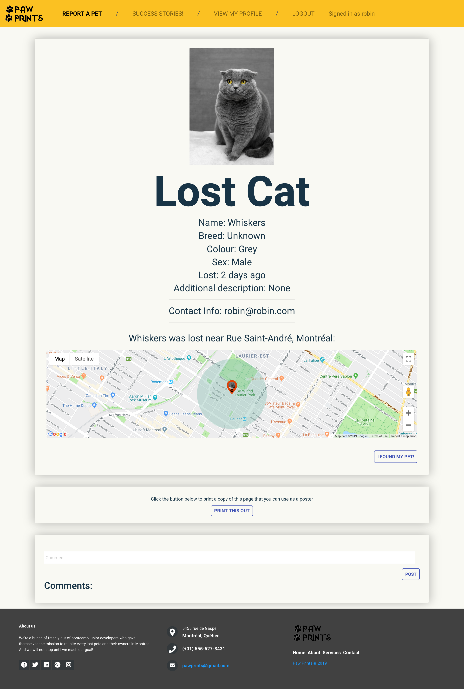
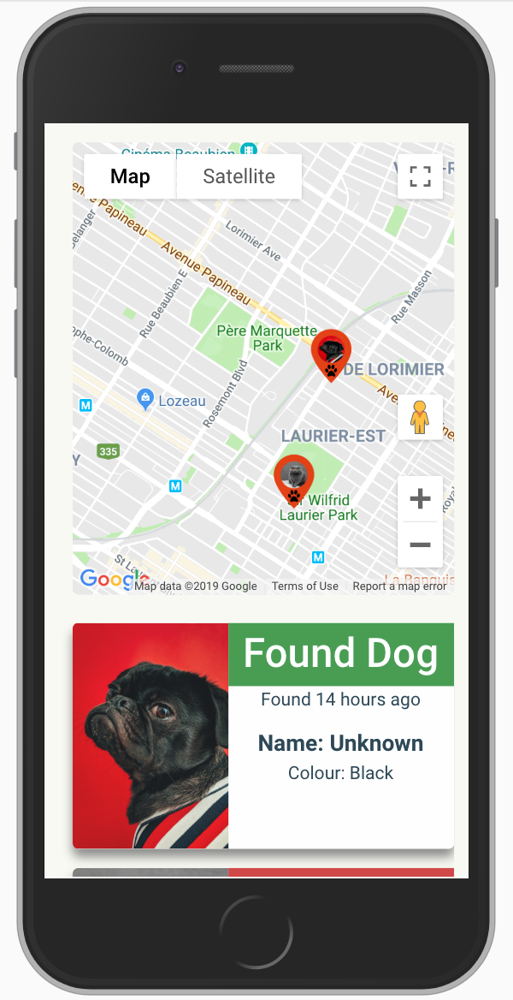
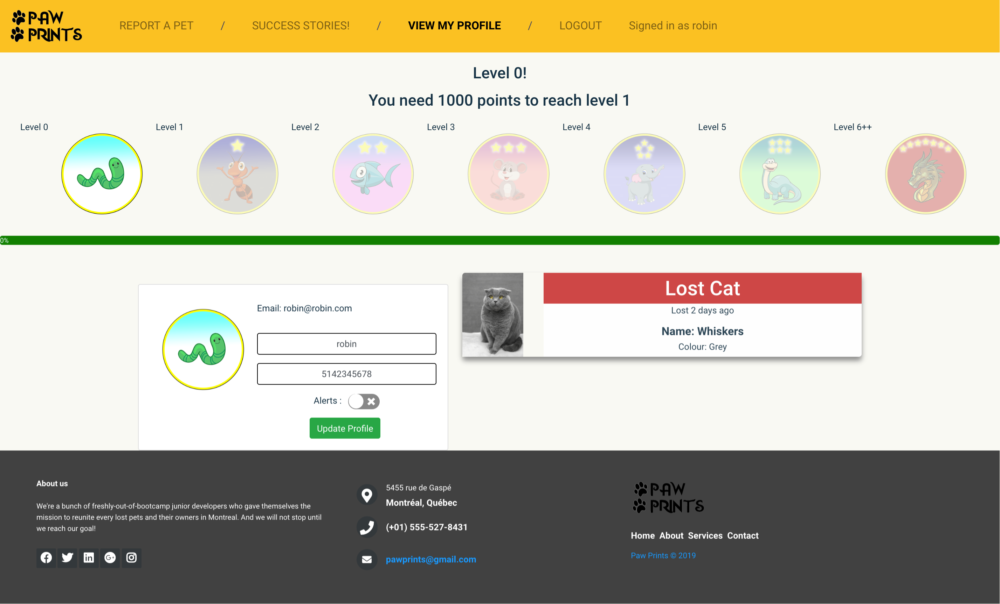

# PawPrints

A web application to help reunite lost pets with their owners. Users can create a profile for their lost pet, which will send a push notification to all subscribed users. Users can search and filter existing profiles and leave a comment if they think they have spotted or found that pet. 

## Languages and frameworks

Built primarily with React and Ruby on Rails. We used PostgreSQL for our database as well as Firebase to host images. Other APIs include Google Maps and Google Push Notifications. We used React Router to create URLs. For styling we used Sass, Bootstrap and Material UI. 

## Screenshots

## Dependencies

ruby, 2.5.1
gem 'rails', 5.2.3 
gem 'pg', 2.0
gem 'puma', 3.11
gem 'bcrypt', 3.1.7
gem 'jwt', 2.2.1
gem 'webpush'

material-ui/core, 4.1.3
material-ui/icons, 4.2.1
axios, 0.19.0
node-sass, 4.12.0
react, 16.8.6
react-bootstrap, 1.0.0-beta.9
react-dom, 16.8.6
react-geocode, 0.1.2
react-google-autocomplete, 1.1.0
react-google-maps, 9.4.5
react-infinite-scroll-component, 4.5.2
react-router-bootstrap, 0.25.0
react-router-dom, 5.0.1
react-scripts, 3.0.1
react-switch, 5.0.0
react-timeago, 4.4.0
recompose, 0.30.0
styled-components, 4.3.2
urlsafe-base64, 1.0.0
